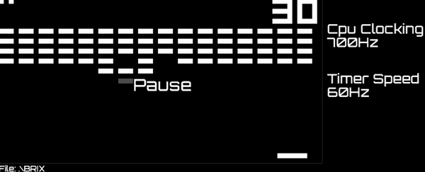

# Chip-8 emulator

Simple chip-8 emulator made with monogame

## Prerequisites

* [.NET core SDK](https://dotnet.microsoft.com/download) (v3.1)

## How to run
First, compile a project.\
In the Src folder, call the command.

```bash
dotnet build
```
There will be 2 interesting files in the location ..\bin\Debug\netcoreapp3.1

>Chip-8-emulator.dll\
>Chip-8-emulator.exe

To start the emulator call the command:
```bash
dotnet Chip-8-emulator.dll [name-of-rom]
```
Or just drag and drop the game rom at Chip-8-emulator.exe file (windows only).

## Gameplay


## Instruction
After completing the steps described in the previous section, the application window will be displayed and the game will start immediately.

### Special Keys
* __F1__ - Reduces CPU clock
* __F2__ - Increases CPU clock
* __F3__ - Reduces timer clocking
* __F4__ - Increases timer clocking
* __F5__ - Resets the game
* __Space__ - Pauses the game
* __Esc__ - Closes the emulator

### Keyboard Map

Input is done with a hex keyboard that has 16 keys ranging 0 to F. After loading the game rom, the emulator looks for a file with the .kb extension in the same folder. A file with the extension kb is an ordinary text file, in the first column there are numbers from 0 to 15 in the second column there are codes corresponding to the keys. The order does not matter, also all characters do not have to be listed, then the keyboard layout will be mixed with the formula below. So this file is used to assign the keys used in the CHIP-8 to the corresponding codes on your keyboard. If the file contains a line in which "TREATASASCII" occurs, then the keys from the keyboard are entered directly into the emulator without replacement (it's not recommended).

If the program has not found a corresponding file with the extension kb then the input keys are converted according to the following formula:
>0 -> 48 '0' \
1 -> 49 '1' \
⋮\
9 -> 57 '9' \
10 -> 113 'q' \
11 -> 119 'w' \
⋮\
15 -> 121 'y'

### CPU Clock
CPU clock speed is the value given in Hertz, which is the maximum number of opcs that can be executed in one second.

Note that this is not the actual number of machine instructions per second.

### Timer Speed
Timer speed is the frequency at which the timer value is decremented.


## Additional Info
The program tested on Windows and Linux, but should also work on Mac.

I am also adding 3 game roms from [zophar.net](https://www.zophar.net/pdroms/chip8/chip-8-games-pack.html). There is also a file "tetris.kb", which allows you to control tetris game using arrows on your keyboard.

## Resources

INVIDERS, TETRIS and BRIX game roms [public domain]\
https://www.zophar.net/pdroms/chip8/chip-8-games-pack.html

Orbitron font [SIL Open Font License v1.10](https://www.fontsquirrel.com/license/Orbitron)\
author: Matt McInerney\
https://www.fontsquirrel.com/fonts/orbitron

The font exists in its original form and as an .xnb files

## License

Source code license: [MIT](https://opensource.org/licenses/MIT)
